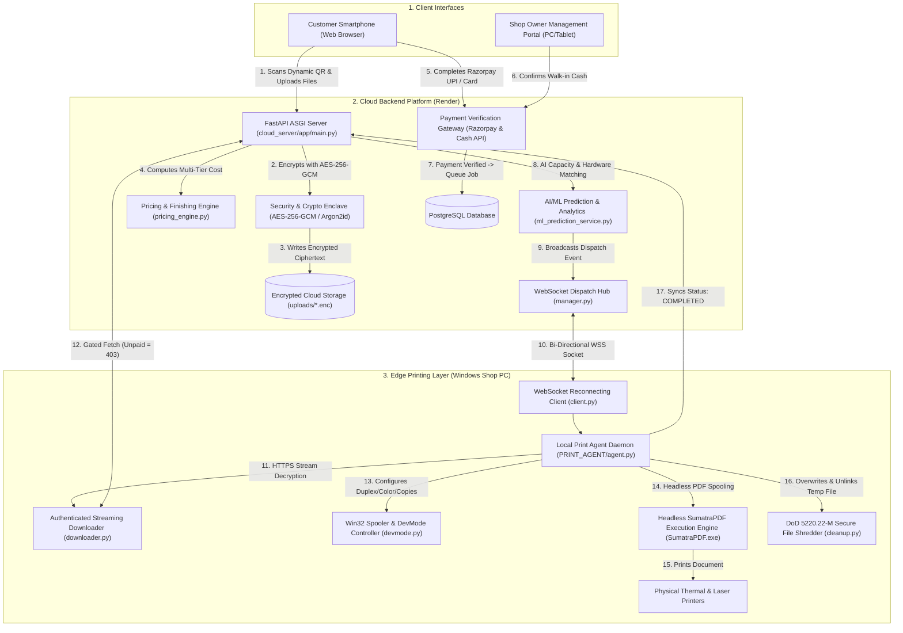

# Architecture & Complete Code Map

This document provides an exhaustive structural, architectural, and component-level code map of the **AI-Based QR Printing System**.

---

## 1. System Architecture Diagram



---

## 2. Directory Structure & Module Responsibilities

```
AI-based-QR-printing-System/
├── Procfile                              # Render ASGI web service process command
├── render.yaml                           # Infrastructure-as-Code deployment descriptor
├── requirements.txt                      # Root Python dependencies (FastAPI, SQLAlchemy, etc.)
├── runtime.txt                           # Python runtime specification (python-3.11.8)
├── DOUBTSOLVED.md                        # Master technical resolution report for 6 doubts
├── PROJECT_DOCUMENTATION/                # 17 in-depth architectural and reference documents
├── PROJECT_AUDIT/                        # Comprehensive audit deliverables
├── tests/                                # 8 automated test suites (63 unit & integration tests)
│   ├── test_api_endpoints.py             # Owner auth, JWT, QR scan, upload endpoints
│   ├── test_core_system.py               # Page counting, multi-file ingestion, pricing rules
│   ├── test_e2e_pipeline.py              # Full owner-to-dispatch pipeline simulation
│   ├── test_finishing_services.py        # Finishing service CRUD, pricing, operator workflow
│   ├── test_frontend_app_routes.py       # Jinja2 template rendering tests
│   ├── test_preview_receipt_voice_printer.py # PDF preview, receipt, voice parser, cashier
│   ├── test_print_agent.py               # Agent config loading, file validator logic
│   └── test_security.py                  # AES-256-GCM, IDOR, path traversal, DoD shredder
├── cloud_server/                         # FastAPI Cloud Backend Application
│   ├── requirements.txt                  # Cloud-specific dependencies
│   ├── app/
│   │   ├── main.py                       # Root FastAPI app, security middleware, routers
│   │   ├── core/
│   │   │   ├── config.py                 # Pydantic Settings & environment variables
│   │   │   ├── crypto.py                 # AES-256-GCM envelope encryption/decryption
│   │   │   └── security.py               # Argon2id/Bcrypt hashing, JWT bearer tokens
│   │   ├── database/
│   │   │   ├── connection.py             # SQLAlchemy engine & PostgreSQL connection pool
│   │   │   └── models.py                 # Declarative ORM models (ShopOwner, ActiveJob, etc.)
│   │   ├── schemas/                      # Pydantic validation schemas (10 schema files)
│   │   ├── services/                     # Business logic services (16 service modules)
│   │   │   ├── analytics_service.py      # Scikit-Learn revenue forecast & peak-hour clustering
│   │   │   ├── assignment_service.py     # Multi-attribute heuristic printer selection
│   │   │   ├── cleanup_service.py        # 2-hour abandoned job & orphaned file cleaner
│   │   │   ├── dispatch_service.py       # WebSocket job dispatch coordinator
│   │   │   ├── ml_prediction_service.py  # Ridge regression & parametric time estimator
│   │   │   ├── page_counter.py           # In-memory PDF/DOCX page count extractor
│   │   │   ├── payment_service.py        # Razorpay API client & transaction handler
│   │   │   ├── preview_service.py        # PDF thumbnail rasterizer (pdf2image)
│   │   │   ├── pricing_engine.py         # Multi-tier cost calculation engine
│   │   │   └── queue_service.py          # FIFO queue manager & position indexer
│   │   ├── api/                          # REST API Routers (17 router modules)
│   │   └── websocket/                    # WebSocket connection manager & endpoint
│   ├── templates/                        # Jinja2 HTML5 UI templates (8 responsive views)
│   └── static/                           # CSS design system, voice assistant JS, logos
└── PRINT_AGENT/                          # Windows Edge Print Agent Service
    ├── agent.py                          # Main background daemon loop
    ├── requirements.txt                  # Edge dependencies (pywin32, websockets, requests)
    ├── core/                             # Agent auth, config, constants, rotating logger
    ├── printers/                         # Win32 discovery, capabilities, DevMode, executors
    ├── services/                         # Downloader, validator, job handler, DoD shredder
    ├── websocket/                        # Reconnecting WebSocket client
    └── tools/                            # Headless SumatraPDF.exe executable asset
```

---

## 3. End-to-End Control Flow & Source Code Evidence

| Execution Step | Function / Endpoint | Source Location | State Change / Data Output |
| :--- | :--- | :--- | :--- |
| **1. Dynamic QR Scan** | `GET /qr/{qr_token}` | [`cloud_server/app/api/session.py:L25-L65`](file:///c:/Users/Abhilash%20S/Desktop/AI-based-QR-printing-System/cloud_server/app/api/session.py#L25-L65) | Creates `ActiveJob(status=PENDING)`; redirects (`303`) to `/upload/{job_id}` |
| **2. Document Upload** | `POST /upload/{job_id}` | [`cloud_server/app/api/upload.py:L65-L185`](file:///c:/Users/Abhilash%20S/Desktop/AI-based-QR-printing-System/cloud_server/app/api/upload.py#L65-L185) | Page counts extracted in RAM; encrypted via `encrypt_document()` to `.enc` |
| **3. Print Settings** | `PUT /file/{file_id}/settings` | [`cloud_server/app/api/file_settings.py:L85-L200`](file:///c:/Users/Abhilash%20S/Desktop/AI-based-QR-printing-System/cloud_server/app/api/file_settings.py#L85-L200) | Evaluates color/BW page splits, duplex, copies; updates `JobFile` |
| **4. Cost Engine** | `calculate_job_price()` | [`cloud_server/app/services/pricing_engine.py:L140-L240`](file:///c:/Users/Abhilash%20S/Desktop/AI-based-QR-printing-System/cloud_server/app/services/pricing_engine.py#L140-L240) | Applies tiered pricing rules + finishing service rates; updates `total_amount` |
| **5. Razorpay Create** | `POST /payment/create/{job_id}`| [`cloud_server/app/api/payment.py:L45-L125`](file:///c:/Users/Abhilash%20S/Desktop/AI-based-QR-printing-System/cloud_server/app/api/payment.py#L45-L125) | Pre-checks printer online; creates Razorpay Order in paise |
| **6. Razorpay Verify** | `POST /payment/verify` | [`cloud_server/app/api/payment.py:L130-L220`](file:///c:/Users/Abhilash%20S/Desktop/AI-based-QR-printing-System/cloud_server/app/api/payment.py#L130-L220) | Verifies HMAC-SHA256 signature; sets `PAID`, `QUEUED`, triggers dispatch |
| **7. Cash Workflow** | `POST /payment/cash-confirm/{id}`| [`cloud_server/app/api/payment.py:L285-L335`](file:///c:/Users/Abhilash%20S/Desktop/AI-based-QR-printing-System/cloud_server/app/api/payment.py#L285-L335) | Operator confirms cash; sets `PAID`, `QUEUED`, triggers dispatch |
| **8. Smart Dispatch** | `dispatch_job_to_agent()` | [`cloud_server/app/services/dispatch_service.py:L6-L80`](file:///c:/Users/Abhilash%20S/Desktop/AI-based-QR-printing-System/cloud_server/app/services/dispatch_service.py#L6-L80) | Evaluates printer candidate score; broadcasts `JOB_DISPATCH` over WebSockets |
| **9. Gated Download** | `GET /download/job/...` | [`cloud_server/app/api/download.py:L35-L140`](file:///c:/Users/Abhilash%20S/Desktop/AI-based-QR-printing-System/cloud_server/app/api/download.py#L35-L140) | Enforces `PAID` verification (Unpaid = `403`); decrypts in RAM and streams |
| **10. Local Spooling**| `execute_print_job()` | [`PRINT_AGENT/printers/advanced_executor.py:L50-L220`](file:///c:/Users/Abhilash%20S/Desktop/AI-based-QR-printing-System/PRINT_AGENT/printers/advanced_executor.py#L50-L220)| Modifies Win32 DevMode; invokes `SumatraPDF.exe` with exact CLI flags |
| **11. DoD Shredding** | `secure_delete()` | [`PRINT_AGENT/services/cleanup.py:L20-L75`](file:///c:/Users/Abhilash%20S/Desktop/AI-based-QR-printing-System/PRINT_AGENT/services/cleanup.py#L20-L75) | Multi-pass random + zero overwrite and unlinking of temporary local files |
| **12. Status Sync** | `report_job_completed()` | [`PRINT_AGENT/services/status_reporter.py:L95-L115`](file:///c:/Users/Abhilash%20S/Desktop/AI-based-QR-printing-System/PRINT_AGENT/services/status_reporter.py#L95-L115)| Updates cloud DB `ActiveJob.status = COMPLETED` and records actual seconds |
