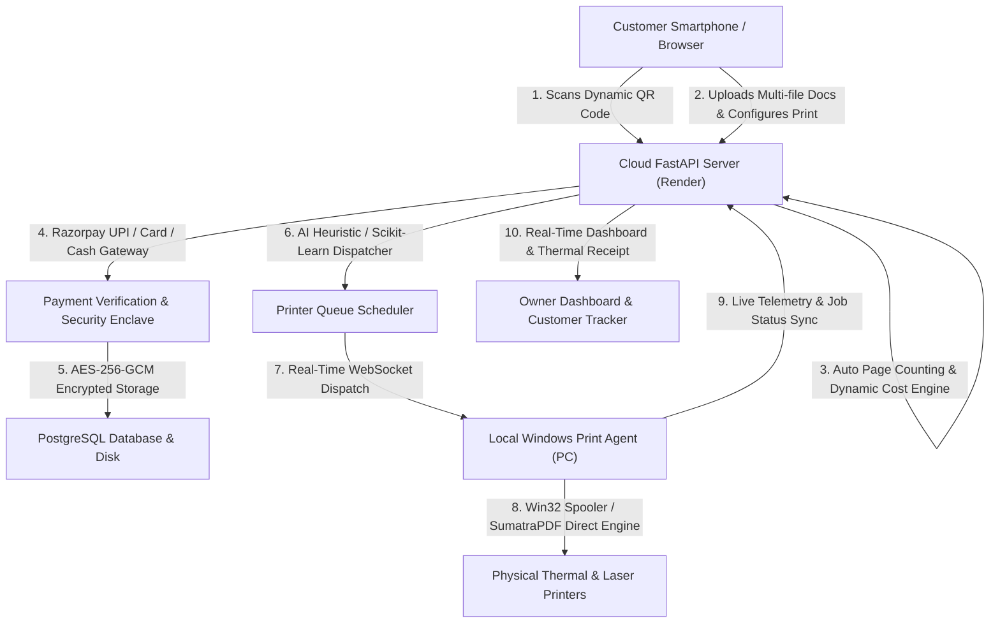

# 00 — Project Overview: AI-Based QR Printing System

## 1. Executive Summary

The **AI-Based QR Printing System** is an end-to-end cloud-and-edge print automation ecosystem designed for print shops, copy centers, and academic institutions. The system bridges cloud-based customer document upload, automated pricing calculation, digital payment gating (via Razorpay and cash approval), queue scheduling, and zero-touch local physical execution through a background Windows Print Agent communicating over WebSockets and authenticated REST APIs.



---

## 2. Core Architecture & Subsystems

The ecosystem is structured into three primary operational tiers:

```
+-----------------------------------------------------------------------------------+
|                                 1. CLOUD SERVER                                   |
|   FastAPI + SQLAlchemy + PostgreSQL + Jinja2 UI + Cryptography + WebSockets       |
|                                                                                   |
|   - Multi-Tenant Shop Owner Management & Auth (Argon2id + JWT)                    |
|   - Dynamic QR Session Routing (/qr/{qr_token} -> /upload/{job_id})               |
|   - Document Ingestion, PDF/DOCX Page Counting & AES-256-GCM Envelope Encryption  |
|   - Multi-Tier Rule-Based Pricing Engine + Value-Added Finishing Services        |
|   - Payment Gating Enclave (Razorpay Verification + Cash Confirmation Workflow)   |
|   - Scikit-Learn ML Forecasting & Heuristic Multi-Attribute Printer Scheduler     |
|   - Bi-directional Real-Time WebSocket Hub (/ws/printer)                         |
|   - Executive Analytics Engine, Live Queue Telemetry & HTML5 Receipt Generator    |
+------------------------------------------+----------------------------------------+
                                           |
                                    HTTPS / WSS / REST
                                           |
+------------------------------------------v----------------------------------------+
|                              2. LOCAL PRINT AGENT                                 |
|         Windows Python Service + Win32 Spooler / DevMode + SumatraPDF CLI         |
|                                                                                   |
|   - Local Hardware Discovery via EnumPrintersW (Win32 API)                        |
|   - Printer Capability Extraction (DC_BINS, DC_PAPERS, DC_DUPLEX, DC_COLOR)       |
|   - Hardware Status & Availability Telemetry (PRINTER_STATUS_PAPER_JAM, etc.)     |
|   - Secure Authenticated Streaming Downloader with SHA-256 Checksum Verification  |
|   - Automated Document Printing via Direct Win32 DevMode or Silent SumatraPDF CLI |
|   - Multi-Pass Secure File Shredding (DOD 5220.22-M Compliant Zero-Overwriting)  |
+-----------------------------------------------------------------------------------+
|                                 3. CLIENT LAYERS                                  |
|                                                                                   |
|   - Customer Mobile UI: File Upload, Preview, Print Settings, Finishing, Payment  |
|   - Shop Owner Portal: Responsive Management Dashboard, Analytics, Queue, Cashier |
+-----------------------------------------------------------------------------------+
```

---

## 3. High-Level Technology Stack

| Layer | Technology | Purpose in Project |
| :--- | :--- | :--- |
| **Backend Web Framework** | **FastAPI** (Python 3.11) | High-performance asynchronous REST API & WebSocket routing |
| **ASGI Server** | **Uvicorn / Gunicorn** | Production async server running on Render |
| **Database ORM** | **SQLAlchemy 2.0** | Object-relational mapping, connection pooling, and multi-tenant schema |
| **Relational Database** | **PostgreSQL** (Production) / **SQLite** (Local fallback) | ACID compliant persistent store for owners, jobs, files, payments, queues |
| **Security & Crypto** | **Cryptography** (`AES-256-GCM`), `Argon2-cffi`, `Passlib`, `PyJWT` | Envelope encryption for customer documents, zero-knowledge DB storage, hashing |
| **Payment Gateway** | **Razorpay Python SDK** + HMAC-SHA256 Signatures | Secure online UPI/card payment verification, order generation, webhooks |
| **Document Processing** | `pypdf`, `python-docx`, `pdf2image`, `Pillow` | In-memory page counting, format validation, PDF thumbnail preview generation |
| **Machine Learning / DS** | `scikit-learn`, `numpy`, `pandas`, `statsmodels` | Linear regression for revenue forecasting, peak-hour analysis, printer recommendations |
| **Frontend Templates** | **Jinja2**, HTML5, Vanilla CSS3, Modern JavaScript (ES6+) | Mobile-first customer UI, owner dashboard, live polling, voice search |
| **Edge Print Service** | `pywin32` (`win32print`, `win32gui`), `websockets`, `requests` | Windows-native print spooler interaction, DevMode manipulation, hardware discovery |
| **Print Helper** | **SumatraPDF** (Bundled Executable) | Silent PDF command-line printing fallback with exact page range passing |
| **Deployment & CI/CD** | **Render.com**, `render.yaml`, `Procfile`, `runtime.txt` | Cloud web service hosting with SSL/TLS termination |

---

## 4. Key Architectural Differentiators

1. **Zero-Touch Dynamic QR Routing**: Each shop owner receives a unique QR code. Customers scan the QR, creating an isolated job session without requiring customer account registration.
2. **Strict Payment-Gated Processing Enclave**: The cloud server and edge agent enforce cryptographic and state-machine gating: unverified or unpaid jobs are strictly forbidden from decryption, dispatching, or spooling.
3. **Multi-File Mixed Configuration**: Customers can configure individual files inside a single job independently (e.g., File 1: A4 Color Duplex, File 2: B&W Single-sided, File 3: Lamination finishing).
4. **End-to-End Cryptographic Protection**: Uploaded customer files are encrypted with AES-256-GCM on arrival in the cloud server. Files remain encrypted at rest and in database metadata, decrypted only transiently in RAM by authorized services or upon authorized local agent fetch.
5. **Real-Time Edge Agent Synchronicity**: Edge print agents running on shop Windows PCs maintain live WebSocket connections to the cloud server, auto-registering physical printers, reporting paper jams/offline states, and pulling queued jobs in real time.
6. **Graceful Fallbacks & Offline Resilience**: Fully functional cash payment confirmation workflow for walk-in customers without online payment, coupled with local print agent automatic reconnection loops.
