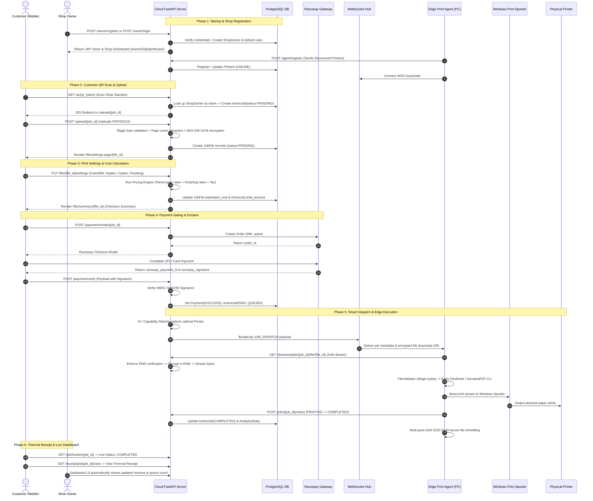

# 03 — Application Startup & End-to-End Execution Flow

This document details the real-world execution flow of the **AI-Based QR Printing System**, tracing interactions from cloud startup to edge physical printing.

---

## 1. System Execution Call Graph

---

## 2. Step-by-Step Execution Lifecycle

### Step 1: Cloud Application Startup
- **Entry File**: `cloud_server/app/main.py`
- **Actions**:
  1. `lifespan(app)` context manager triggers.
  2. `init_db()` connects to PostgreSQL (or SQLite fallback) and verifies table schemas.
  3. `uploads/` directory is created with secure restricted file permissions.
  4. Middleware stack active: Security headers (`X-Content-Type-Options`, `X-Frame-Options`, `X-XSS-Protection`) and CORS allow rules.
  5. 17 REST API routers and 1 WebSocket router mounted.

### Step 2: Edge Print Agent Startup & Discovery
- **Entry File**: `PRINT_AGENT/agent.py`
- **Actions**:
  1. Calls `PRINT_AGENT/printers/discovery.py` -> `win32print.EnumPrinters()`.
  2. Identifies all connected USB, Network, and Virtual printers.
  3. Calls `PRINT_AGENT/printers/capabilities.py` to extract supported page sizes, duplex support, and color modes.
  4. Dispatches REST `POST /agent/register` to Cloud Server with printer list.
  5. Opens persistent WebSocket client connection to `wss://<cloud-url>/ws/printer`.

### Step 3: Customer QR Code Session Initialization
- **First Point of Contact**: `GET /qr/{qr_token}` (`cloud_server/app/api/session.py`)
- **Actions**:
  1. Customer scans the shop's physical QR standee with their phone camera.
  2. Cloud server looks up `ShopOwner` associated with `qr_token`.
  3. Checks if shop is active.
  4. Automatically instantiates a new `ActiveJob` record with `status = "PENDING"`, `payment_status = "PENDING"`.
  5. Returns HTTP `303 See Other` redirecting customer's browser to `/upload/{job_id}`.

### Step 4: Multi-File Document Ingestion & Encryption
- **Endpoint**: `POST /upload/{job_id}` (`cloud_server/app/api/upload.py`)
- **Actions**:
  1. Customer selects one or multiple PDF, DOCX, PNG, or JPG files.
  2. Server performs filename sanitization (stripping `../` path traversals).
  3. Checks magic bytes (`%PDF-` for PDFs, `PK\x03\x04` for DOCX).
  4. Invokes `page_counter.py` to extract page count.
  5. Ingests raw binary into `crypto.py` -> `encrypt_document()`.
  6. Writes encrypted envelope (`.enc` file with `AEP1` magic header and random 12-byte IV) to `uploads/`.
  7. Inserts `JobFile` records into PostgreSQL.
  8. Triggers initial pricing calculation and redirects user to `/file/settings-page/{file_id}`.

### Step 5: Print Setting Configuration & Dynamic Pricing
- **Endpoint**: `PUT /file/{file_id}/settings` (`cloud_server/app/api/file_settings.py`)
- **Actions**:
  1. Customer configures: Copies ($N$), Color Mode (`ALL_BW`, `ALL_COLOR`, `CUSTOM_MIXED`), Duplex (`True`/`False`), Paper Size (`A4`/`A3`/`LEGAL`), and Finishing Services (Spiral Binding, Lamination).
  2. Voice commands parsed in real-time via `voice_search.js` if the user uses voice input.
  3. `pricing_engine.py` evaluates:
     - Base tiered rates from `PricingRule` matching shop owner and page volume.
     - Custom page range splitting (e.g. 5 color pages + 20 black & white pages).
     - Value-added finishing service unit pricing.
     - Tax calculation (e.g. 5% GST if configured in `ShopSettings`).
  4. Updates `ActiveJob.total_amount`.
  5. Displays checkout summary (`price_summary.html`).

### Step 6: Razorpay Payment Verification Enclave
- **Endpoints**: `POST /payment/create/{job_id}` and `POST /payment/verify` (`cloud_server/app/api/payment.py`)
- **Actions**:
  1. Pre-payment check: Verifies at least one printer for the shop is currently `ONLINE`.
  2. Server invokes `razorpay_client.order.create()` for the exact amount in paise.
  3. Customer completes checkout via UPI, Card, or Netbanking.
  4. Customer frontend posts `razorpay_order_id`, `razorpay_payment_id`, `razorpay_signature` to `/payment/verify`.
  5. Server recomputes HMAC-SHA256 signature using `PAYMENT_GATEWAY_KEY_SECRET`.
  6. If signature matches:
     - `Payment.status` -> `SUCCESS`.
     - `ActiveJob.payment_status` -> `PAID`.
     - `ActiveJob.status` -> `QUEUED`.
     - Job enters FIFO queue via `queue_service.py`.
     - `dispatch_service.py` is immediately invoked.

### Step 7: Cash Payment Alternative Workflow
- **Endpoints**: `POST /payment/cash/{job_id}` and `POST /payment/cash-confirm/{job_id}`
- **Actions**:
  1. If customer chooses "Pay Cash at Counter", `ActiveJob.payment_status` becomes `PENDING_CASH_APPROVAL`.
  2. Shop owner receives instant notification on `dashboard.html`.
  3. Owner clicks "Confirm Cash Payment" after receiving cash.
  4. Server transitions job to `PAID` and `QUEUED`, triggering automatic print dispatch.

### Step 8: Smart Dispatch & Edge Agent Physical Printing
- **Service**: `cloud_server/app/services/dispatch_service.py` & `PRINT_AGENT/agent.py`
- **Actions**:
  1. `assignment_service.py` evaluates active printers: filters by required capabilities (color, duplex, paper size) and selects the printer with the lowest queue depth.
  2. Cloud server broadcasts WebSocket JSON payload `JOB_DISPATCH` containing `job_id`, `file_id`, and download token.
  3. Edge agent receives event, calls `/download/job/{job_id}/file/{file_id}` with Authorization headers.
  4. Cloud download endpoint strictly validates `payment_status == PAID`, decrypts payload from `.enc` in RAM, and streams decrypted binary.
  5. Edge agent saves to temporary folder, validates magic bytes, and executes via `advanced_executor.py` / `SumatraPDF.exe`.
  6. Edge agent monitors spooler and notifies Cloud Server via `POST /jobs/{job_id}/status` (`PRINTING` -> `COMPLETED`).
  7. Edge agent securely shreds temporary local files using DoD 5220.22-M compliant overwriting in `cleanup.py`.

### Step 9: Live Tracking, Thermal Receipt & Analytics
- **Endpoints**: `GET /job/tracker/{job_id}` and `GET /receipt/job/{job_id}/view`
- **Actions**:
  1. Customer mobile screen automatically updates to show "Print Completed! Please collect your documents from the counter."
  2. Customer can view or download an official thermal-style PDF/HTML receipt.
  3. Cloud server records job volume, color/BW breakdown, and revenue in `AnalyticsDaily`.
  4. Owner dashboard updates charts, printer counters, and forecasting models.
