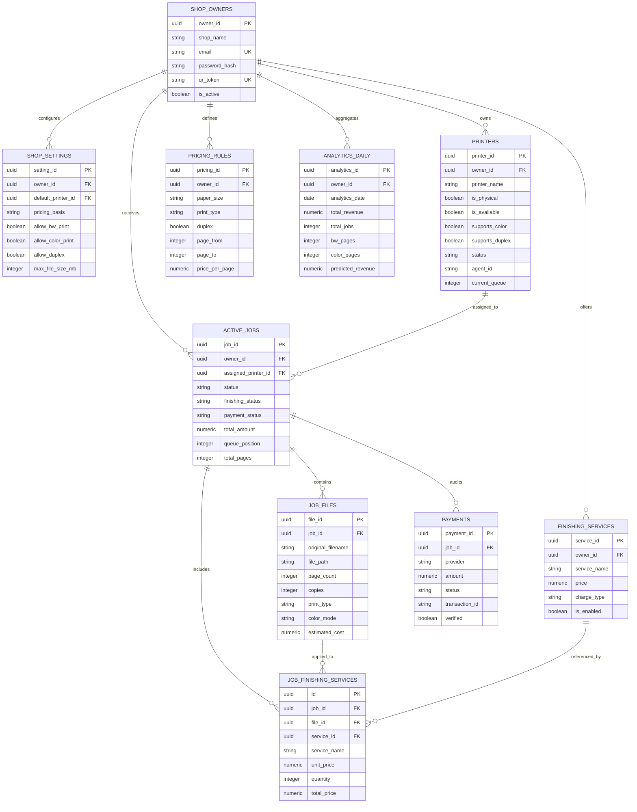

# 05 — Database Schema, Relationships & Models

This document details the relational data model of the **AI-Based QR Printing System**, implemented via SQLAlchemy ORM for PostgreSQL.

---

## 1. Entity-Relationship (ER) Diagram

---

## 2. Table-by-Table Architectural Reference

### 2.1 Table: `shop_owners`
- **Model**: `ShopOwner` ([`app/database/models.py:L45-L95`](file:///c:/Users/Abhilash%20S/Desktop/AI-based-QR-printing-System/cloud_server/app/database/models.py#L45-L95))
- **Primary Key**: `owner_id` (UUID, Default `uuid.uuid4`)
- **Columns**:
  - `owner_id`: UUID, Primary Key.
  - `shop_name`: String(150), Not Null.
  - `owner_name`: String(100), Not Null.
  - `shop_logo`: String(255), Nullable.
  - `email`: String(150), Unique, Not Null.
  - `phone`: String(20), Not Null.
  - `password_hash`: String(255), Not Null (Argon2id/Bcrypt hash).
  - `upi_id`: String(100), Nullable.
  - `address`: Text, Nullable.
  - `qr_token`: String(100), Unique, Indexed, Not Null.
  - `qr_path`: String(255), Nullable (Path to generated standee PNG).
  - `is_active`: Boolean, Default `True`.
  - `created_at`, `updated_at`: DateTime.
- **Relationships**:
  - One-to-One: `settings` (`ShopSettings`).
  - One-to-Many: `printers`, `jobs`, `pricing_rules`, `finishing_services`, `analytics`.

---

### 2.2 Table: `active_jobs`
- **Model**: `ActiveJob` ([`app/database/models.py:L240-L330`](file:///c:/Users/Abhilash%20S/Desktop/AI-based-QR-printing-System/cloud_server/app/database/models.py#L240-L330))
- **Primary Key**: `job_id` (UUID)
- **Foreign Keys**:
  - `owner_id` -> `shop_owners.owner_id` (Not Null).
  - `assigned_printer_id` -> `printers.printer_id` (Nullable).
- **Columns**:
  - `customer_name`: String(100), Nullable.
  - `customer_phone`: String(20), Nullable.
  - `status`: Enum (`JobStatus`: `PENDING`, `QUEUED`, `PRINTING`, `COMPLETED`, `FAILED`, `CANCELLED`).
  - `finishing_status`: Enum (`FinishingStatus`: `NONE`, `PENDING_FINISHING`, `FINISHING_COMPLETED`).
  - `payment_status`: Enum (`PaymentStatus`: `PENDING`, `PAID`, `FAILED`, `REFUNDED`, `PENDING_CASH_APPROVAL`).
  - `queue_position`: Integer, Nullable (FIFO index in active queue).
  - `priority`: Integer, Default `0`.
  - `total_files`, `total_pages`, `total_copies`: Integer.
  - `subtotal`, `tax`, `total_amount`: Numeric(10, 2).
  - `estimated_seconds`: Integer (Calculated duration).
  - `queued_at`, `started_at`, `completed_at`: DateTime.

---

### 2.3 Table: `job_files`
- **Model**: `JobFile` ([`app/database/models.py:L345-L420`](file:///c:/Users/Abhilash%20S/Desktop/AI-based-QR-printing-System/cloud_server/app/database/models.py#L345-L420))
- **Primary Key**: `file_id` (UUID)
- **Foreign Keys**:
  - `job_id` -> `active_jobs.job_id` (On Delete Cascade).
- **Columns**:
  - `original_filename`: String(255), Not Null.
  - `stored_filename`: String(255), Nullable (Encrypted on-disk reference).
  - `file_path`: Text, Nullable (Relative path in `uploads/`).
  - `file_type`: String(20), Nullable (`.pdf`, `.docx`, `.png`, `.jpg`).
  - `file_size`: Integer (Bytes).
  - `page_count`: Integer, Default `1`.
  - `copies`: Integer, Default `1`.
  - `paper_size`: Enum (`PaperSize`: `A4`, `A3`, `LEGAL`).
  - `orientation`: Enum (`Orientation`: `PORTRAIT`, `LANDSCAPE`, `AUTO`).
  - `duplex`: Boolean, Default `False`.
  - `print_type`: Enum (`PrintType`: `BW`, `COLOR`).
  - `color_mode`: String(30), Default `"ALL_BW"` (`ALL_BW`, `ALL_COLOR`, `CUSTOM_MIXED`).
  - `color_page_ranges`: String(255), Nullable (e.g., `"1,3-5"`).
  - `bw_pages`, `color_pages`: Integer.
  - `estimated_cost`: Numeric(10, 2).
  - `print_completed`: Boolean, Default `False`.

---

### 2.4 Table: `pricing_rules`
- **Model**: `PricingRule` ([`app/database/models.py:L430-L480`](file:///c:/Users/Abhilash%20S/Desktop/AI-based-QR-printing-System/cloud_server/app/database/models.py#L430-L480))
- **Primary Key**: `pricing_id` (UUID)
- **Foreign Keys**: `owner_id` -> `shop_owners.owner_id`.
- **Columns**:
  - `paper_size`: Enum (`A4`, `A3`, `LEGAL`).
  - `print_type`: Enum (`BW`, `COLOR`).
  - `duplex`: Boolean, Default `False`.
  - `page_from`, `page_to`: Integer (Tier threshold: e.g., 1 to 10 pages, 11 to 50 pages, 51+ pages).
  - `price_per_page`: Numeric(10, 2), Not Null.
  - `is_active`: Boolean, Default `True`.

---

### 2.5 Table: `finishing_services` & `job_finishing_services`
- **Models**: `FinishingService` and `JobFinishingService` ([`app/database/models.py:L580-L650`](file:///c:/Users/Abhilash%20S/Desktop/AI-based-QR-printing-System/cloud_server/app/database/models.py#L580-L650))
- **Purpose**: Tracks shop value-added offerings (Spiral Binding, Thermal Binding, Soft Binding, Lamination, Corner Stapling).
- **Columns in `finishing_services`**:
  - `service_id`: UUID PK.
  - `owner_id`: UUID FK.
  - `service_name`: String(100).
  - `price`: Numeric(10, 2).
  - `charge_type`: String(50) (`PER_JOB` or `PER_FILE`).
  - `is_enabled`: Boolean.
- **Columns in `job_finishing_services`**:
  - `id`: UUID PK.
  - `job_id`: UUID FK -> `active_jobs.job_id`.
  - `file_id`: UUID FK -> `job_files.file_id` (Nullable if job-level).
  - `service_id`: UUID FK -> `finishing_services.service_id`.
  - `unit_price`, `quantity`, `total_price`: Numeric.

---

### 2.6 Table: `payments`
- **Model**: `Payment` ([`app/database/models.py:L490-L540`](file:///c:/Users/Abhilash%20S/Desktop/AI-based-QR-printing-System/cloud_server/app/database/models.py#L490-L540))
- **Primary Key**: `payment_id` (UUID)
- **Foreign Keys**: `job_id` -> `active_jobs.job_id`.
- **Columns**:
  - `provider`: Enum (`PaymentProvider`: `RAZORPAY`, `CASH`, `UPI`, `OFFLINE`).
  - `payment_method`: String(10), Nullable (`UPI`, `CARD`, `NETBANKING`, `CASH`).
  - `amount`: Numeric(10, 2), Not Null.
  - `status`: Enum (`PaymentStatus`: `PENDING`, `SUCCESS`, `FAILED`, `REFUNDED`).
  - `currency`: String(10), Default `"INR"`.
  - `transaction_id`: String(150), Nullable (Razorpay Order ID `order_xxx`).
  - `provider_payment_id`: String(150), Nullable (Razorpay Payment ID `pay_xxx`).
  - `verified`: Boolean, Default `False`.
  - `verified_at`: DateTime, Nullable.
  - `paid_at`: DateTime, Nullable.

---

### 2.7 Table: `analytics_daily`
- **Model**: `AnalyticsDaily` ([`app/database/models.py:L550-L610`](file:///c:/Users/Abhilash%20S/Desktop/AI-based-QR-printing-System/cloud_server/app/database/models.py#L550-L610))
- **Primary Key**: `analytics_id` (UUID)
- **Foreign Keys**: `owner_id` -> `shop_owners.owner_id`.
- **Columns**:
  - `analytics_date`: Date, Not Null, Indexed.
  - `total_jobs`, `completed_jobs`, `failed_jobs`, `cancelled_jobs`: Integer.
  - `total_files`, `total_pages`, `bw_pages`, `color_pages`: Integer.
  - `total_revenue`, `total_tax`, `total_refunds`, `average_job_value`: Numeric(12, 2).
  - `peak_queue_length`, `average_wait_time`: Integer.
  - `predicted_jobs`, `predicted_pages`, `predicted_revenue`: Numeric.
  - `predicted_peak_hour`: Integer (0-23).
  - `printer_recommendation`, `business_insight`: Text.
  - `anomaly_detected`: Boolean.
