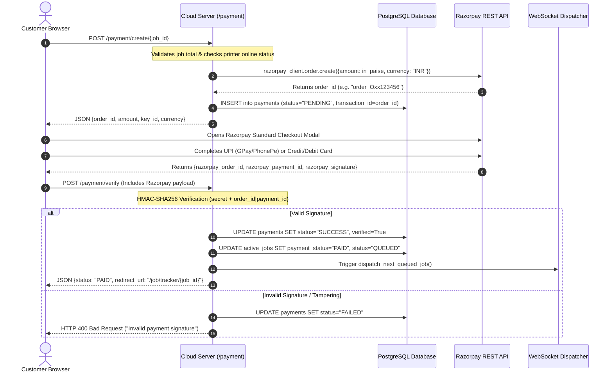

# 08 — Razorpay Payment Flow & Financial Security Enclave

This document provides a comprehensive security and implementation audit of the **Razorpay Payment Gateway Integration** and cash workflows in the system.

---

## 1. Razorpay End-to-End Execution Sequence



---

## 2. Server-Side Signature Verification & Cryptographic Integrity

### 2.1 HMAC-SHA256 Verification Implementation
- **Source Location**: `cloud_server/app/api/payment.py` ([L130-L220](file:///c:/Users/Abhilash%20S/Desktop/AI-based-QR-printing-System/cloud_server/app/api/payment.py#L130-L220))
- **Mathematical Principle**:
  $$\text{Expected Signature} = \text{HMAC-SHA256}(\text{key}=\text{PAYMENT\_GATEWAY\_KEY\_SECRET}, \text{msg}=\text{order\_id} \parallel \text{"|"} \parallel \text{payment\_id})$$
- **Code Logic**:
  ```python
  generated_signature = hmac.new(
      settings.PAYMENT_GATEWAY_KEY_SECRET.encode("utf-8"),
      f"{payload.razorpay_order_id}|{payload.razorpay_payment_id}".encode("utf-8"),
      hashlib.sha256
  ).hexdigest()

  if not hmac.compare_digest(generated_signature, payload.razorpay_signature):
      raise HTTPException(status_code=400, detail="Invalid payment signature.")
  ```
- **Security Guarantee**: `hmac.compare_digest()` is used to eliminate timing attack vulnerabilities.

---

## 3. Strict Payment-Gated Security Rules

1. **Zero Unpaid Decryption Policy**:
   - The file download route (`GET /download/job/{job_id}/file/{file_id}`) rejects any download request with HTTP `403 Forbidden` if `ActiveJob.payment_status != PaymentStatus.PAID`.
   - Files remain encrypted on disk with AES-256-GCM until verified payment occurs.
2. **Offline Hardware Guard**:
   - `POST /payment/create/{job_id}` verifies that at least one printer registered to the target shop has `status == "ONLINE"`. If all printers are offline, the payment creation request is blocked with HTTP `400 Bad Request` to prevent taking customer funds when printing is impossible.
3. **Idempotency & Duplicate Webhook Handling**:
   - `POST /payment/webhook` checks if the payment record is already marked `SUCCESS`. If already verified, subsequent duplicate webhook payloads return HTTP `200 OK` without triggering duplicate queue entries or double prints.

---

## 4. Cash Payment Confirmation Workflow

For customers who prefer cash or lack digital payment access:
1. Customer clicks "Pay Cash at Counter" -> Calls `POST /payment/cash/{job_id}`.
2. Job is marked `payment_status = "PENDING_CASH_APPROVAL"`.
3. Job is **NOT** sent to the printer queue.
4. Shop owner's dashboard displays a real-time cashier banner with customer name, job ID, and amount due.
5. Once the shop owner collects the cash, the owner clicks "Confirm Cash Payment" (`POST /payment/cash-confirm/{job_id}`).
6. Server marks `payment_status = "PAID"` and pushes the job to the print queue.
