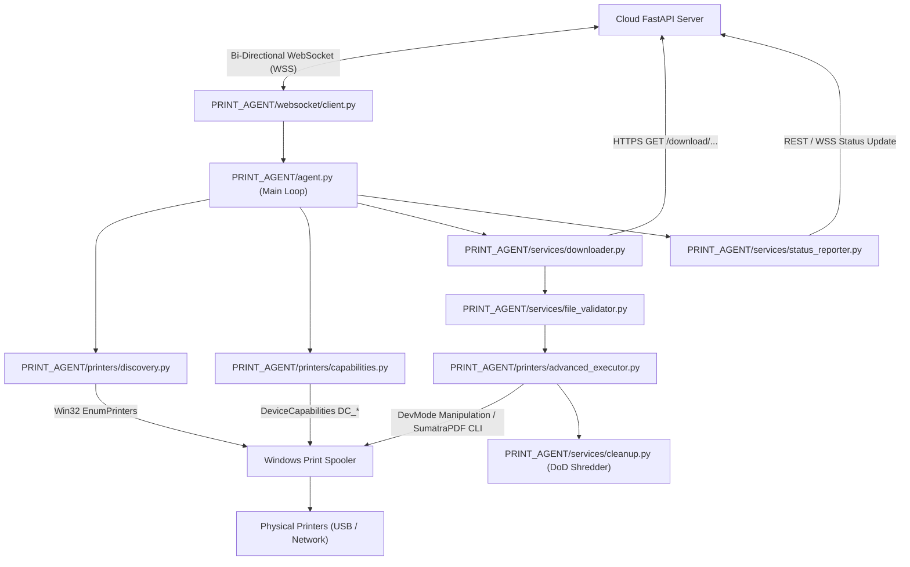

# 09 — Local Print Agent & Windows Printer Integration

This document details the architecture, Win32 spooler integration, WebSocket communication, and secure execution lifecycle of the **Local Print Agent** (`PRINT_AGENT/`).

---

## 1. Local Print Agent Subsystem Architecture



---

## 2. Windows Native Printer Discovery & Capability Extraction

### 2.1 Hardware Discovery (`PRINT_AGENT/printers/discovery.py`)
- **API Call**: `win32print.EnumPrinters(win32print.PRINTER_ENUM_LOCAL | win32print.PRINTER_ENUM_CONNECTIONS)`
- **Discovered Attributes**:
  - `printer_name`: System name (e.g. `"HP LaserJet Pro MFP M428fdw"`, `"Canon LBP2900"`).
  - `port_name`: USB001, WSD, or TCP/IP RAW IP port.
  - `driver_name`: Windows printer driver descriptor.
  - `status`: Win32 status bits (`PRINTER_STATUS_PAPER_JAM`, `PRINTER_STATUS_OUT_OF_MEMORY`, etc.).

### 2.2 Device Capabilities Inspection (`PRINT_AGENT/printers/capabilities.py`)
- **Win32 API**: `win32print.DeviceCapabilities(pDevice, pPort, fwCapability)`
- **Flags Queried**:
  - `DC_PAPERS` / `DC_PAPERNAMES`: Supported physical paper sizes (A4, A3, Legal, Letter).
  - `DC_DUPLEX`: Returns `1` if hardware supports automatic two-sided printing.
  - `DC_COLOR`: Returns `1` if device contains color toner/ink engine.
  - `DC_BINS` / `DC_BINNAMES`: Discovered input trays (Tray 1, Tray 2, Manual Feeder).
  - `DC_ENUMRESOLUTIONS`: Supported DPI resolutions (600x600, 1200x1200).

---

## 3. DevMode Structure Modification (`PRINT_AGENT/printers/devmode.py`)

To guarantee that duplex, orientation, and color modes take effect without opening a Windows print dialog, the agent manipulates the Win32 `DEVMODEW` binary structure directly:

```python
# Extract current DevMode
hPrinter = win32print.OpenPrinter(printer_name)
devmode = win32print.GetPrinter(hPrinter, 2)["pDevMode"]

# Set Duplex Mode
if duplex:
    devmode.dmDuplex = 2 # DMDUP_VERTICAL (Long-edge binding)
    devmode.dmFields |= 0x00001000 # DM_DUPLEX flag

# Set Color Mode
if color_mode == "COLOR":
    devmode.dmColor = 2 # DMCOLOR_COLOR
else:
    devmode.dmColor = 1 # DMCOLOR_MONOCHROME
devmode.dmFields |= 0x00000800 # DM_COLOR flag

# Set Copies
devmode.dmCopies = copies
devmode.dmFields |= 0x00000100 # DM_COPIES flag
```

---

## 4. Headless Execution Engine: SumatraPDF Integration

For PDF files, the agent uses the bundled standalone `SumatraPDF.exe` executable ([`PRINT_AGENT/tools/SumatraPDF.exe`](file:///c:/Users/Abhilash%20S/Desktop/AI-based-QR-printing-System/PRINT_AGENT/tools/SumatraPDF.exe)):

### Command Line Invocation Syntax
```cmd
SumatraPDF.exe -print-to "<PrinterName>" -print-settings "<copies>x,duplex=...,color=...,<page_ranges>" -silent "<file_path>"
```

### Why SumatraPDF is Used:
1. **Zero User Interaction**: Runs headlessly in the background without UI popups or stealing window focus.
2. **Exact Page Range Support**: Native `-print-settings` flag allows printing exact page sets (e.g. `1,3,5-10`).
3. **No External Acrobat Dependency**: Completely standalone, eliminating Adobe Acrobat license or update issues.

---

## 5. DoD 5220.22-M Compliant Secure Local File Shredding

To protect customer privacy on the local PC, downloaded documents are never deleted with simple `os.remove()`, which leaves recoverable data in disk blocks.

- **File**: `PRINT_AGENT/services/cleanup.py` ([`cleanup.py:L20-L70`](file:///c:/Users/Abhilash%20S/Desktop/AI-based-QR-printing-System/PRINT_AGENT/services/cleanup.py#L20-L70))
- **Shredding Procedure**:
  1. Opens file handle with write-binary permissions.
  2. **Pass 1**: Overwrites entire file length with pseudo-random cryptographically generated bytes.
  3. **Pass 2**: Overwrites entire file length with null bytes (`\x00`).
  4. Truncates file size to 0 bytes.
  5. Flushes OS write buffers (`os.fsync()`).
  6. Unlinks file from filesystem (`os.remove()`).
